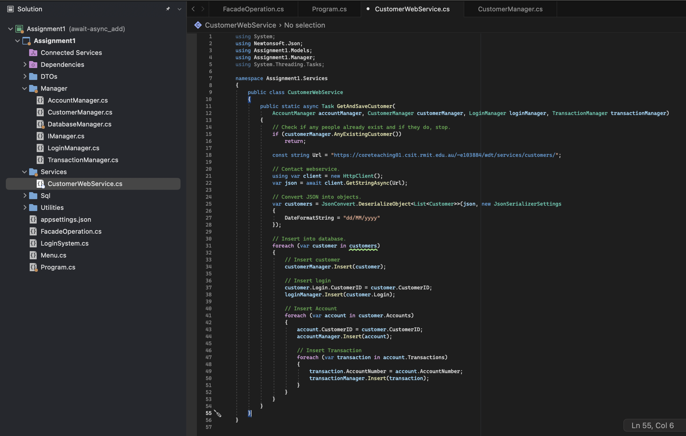

# 🙋‍♀️ Authors: s3959666-s3961136-a1
# 💸 MCBA (Most Common Bank of Australia)

  

## 🔗 Table of Contents
1. [About the Project](#about-the-project)
2. [Demo](#demo)
3. [Installation Guide](#installation-guide)
4. [Technology Stack](#technology-stack)
5. [Design Patterns](#design-patterns)
6. [Class Library Justification](#class-library-justification)
7. [Asynchronous Programming](#asynchronous-programming)
8. [Trello Board Screenshots](#trello-board-screenshots)

## 🔭 About the Project
The console banking application is designed to provide basic banking functionality through a text-based console interface. It allows customers to perform various banking operations such as depositing, withdrawing, transferring funds, checking their account statements, and logging out.

## Demo
(If applicable, provide links or screenshots for a demo of the project.)

## Installation Guide
(Step-by-step instructions on how to install and run your project.)

## 🛠 Technology Stack
- 
- 
- 
- 

## 📦 Design Patterns
### DTO Pattern in DTO Deserialisation
- **Summary**: DTO (Data Transfer Object) is a pattern used to transfer data between parts of a software application. It encapsulates data into a single object, reducing the number of calls and simplifying data transfer, especially in network environments. DTOs are simple, serializable objects used mainly for data transport without business logic.
- **Purpose**: DTO is used to efficiently transfer data between different parts of a software application, serving as a container for data
- **Advantages**:
  - Reduced Network Calls: DTOs reduce the number of calls between application layers by bundling multiple data fields into a single object.
  - Simplified Data Transfer: They simplify the process of transferring data, especially in distributed or networked environments.
  - Encapsulation: DTOs encapsulate data, separating it from business logic, promoting clean code architecture.
  - Serialization: DTOs are serializable, making them suitable for data exchange in various formats.
- **Implementation Details**:

  <ul>
    <li>Define DTO Classes: Create DTO classes (Account, Customer, Login, and Transaction) which are structured for data transfer.
       
       
       
       
    </li>
    <li>Use DTOs in Service Layer: In CustomerWebService, we deserialize JSON data into DTOs and use domain models.
    </li>
  </ul>

- **Additional Comments**:

### Facade Pattern in Managers
- **Summary**: The Facade pattern simplifies interactions with a complex system by providing a single unified interface. This pattern hides the system's complexity and makes it more accessible and easier for clients to use.
- **Purpose**: Simplify interactions with complex systems by offering a single, user-friendly interface.
- **Advantages**:
  - Complexity Concealment: Facade hides the intricate details of the system, shielding clients from its complexity.
  - User-Friendly: It offers a user-friendly interface that simplifies interactions.
  - Abstraction Layer: Acts as an abstraction layer, reducing the learning curve for clients.
  - Improved Maintainability: Changes to the underlying system can be isolated within the facade, minimizing the impact on clients.
- **Implementation Details**:

  <ul>
    <li>Create <code>FacadeOperation</code> to provide a simple way for users to load data and run the program, hiding the complexity of individual managers.</li>
    <li>Apply Separation of Concerns: Managers like <code>AccountManager</code>, <code>CustomerManager</code>, <code>TransactionManager</code>, and <code>LoginManager</code> each handle specific tasks, aligning with the Single Responsibility Principle.</li>
    <li>Simplify Interface for Users: The <code>LoadingData</code> and <code>RunProgram</code> methods are clear entry points for client code, with <code>LoadingData</code> handling data initialization/loading before program execution.</li>
  </ul>
  

- **Additional Comments**:

### Dependency Injection in Managers
- **Summary**: Dependency Injection is a technique in programming where objects receive their dependencies from an external source rather than creating them themselves. This promotes loosely coupled and easily testable code, as it separates object creation from object use.
- **Purpose**: Enhance code maintainability, testability, and flexibility
- **Advantages**:
  - Loose Coupling: DI decouples managers from dependencies, making the code modular and maintainable.
  - Testability: Simplifies unit testing by enabling the use of mock objects or test implementations for dependencies.
  - Flexibility: Managers can be configured with different dependencies at runtime, offering application behavior flexibility.
  - Reusability: Components and services can be reused across multiple managers.
- **Implementation Details**:

  
  
  

- **Additional Comments**:

## 📓 Class Library Justification
(Explanation of the class library used, if any.)

## ⏱️ Asynchronous Programming
- **Summary**: Async and await are used in programming to do tasks in the background. 'Async' tells the computer that a function can run while other things are happening. 'Await' is used inside these functions to wait for a task to finish without stopping everything else. 
- **Purpose**: Enhances application responsiveness and scalability. It facilitates non-blocking execution of tasks like I/O operations and network requests, ensuring user interactions remain smooth.
- **Advantages**:
  - Responsiveness: Asynchronous tasks prevent applications from freezing when executing time-consuming operations.
  - Efficiency: Concurrent execution of tasks maximizes CPU and resource utilization.
  - Scalability: Asynchronous code can handle multiple concurrent requests or operations efficiently.
  - Improved User Experience: Applications feel more responsive and smooth to users.
- **Implementation Details**:

  

- **Additional Comments**:

### 📋 Trello Board Screenshots

  
  
  
  
  
  
  

